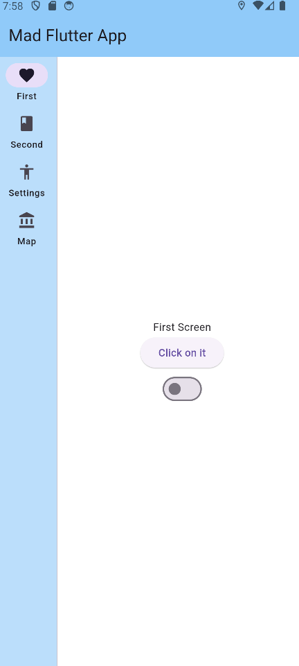
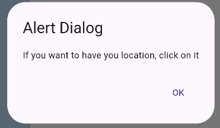
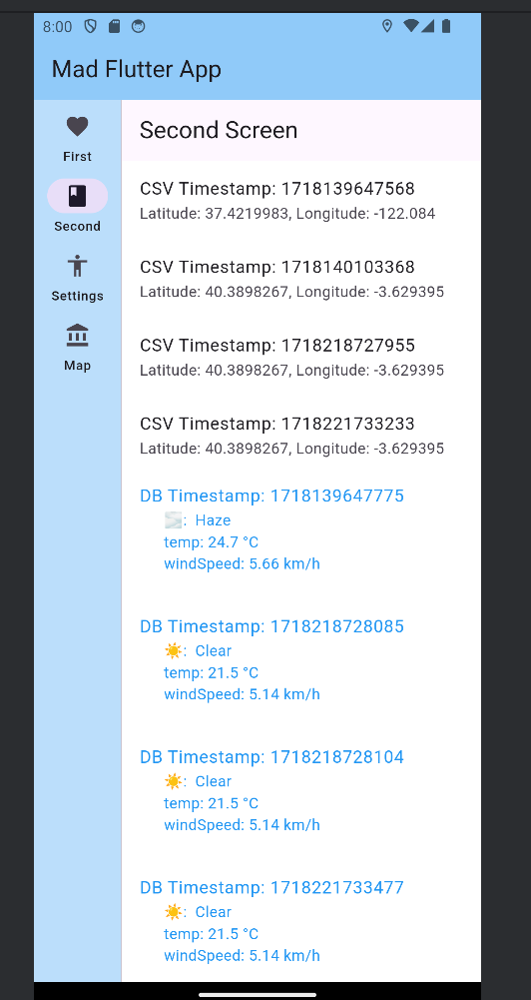
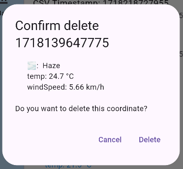
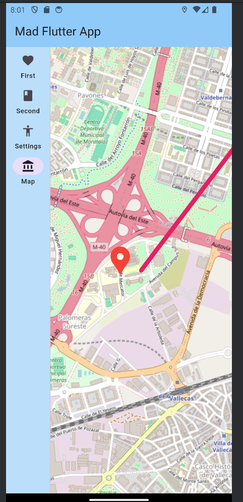
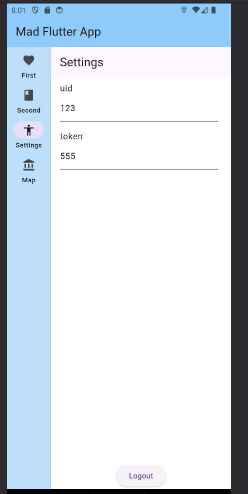

# Mad Flutter app

## Workspace 
Github:  
- Repository: https://github.com/maiwennfch/MADFluter/tree/master
- Releases: https://github.com/maiwennfch/MADFluter/releases/tag/w19.2024   

Workspace: https://upm365.sharepoint.com/sites/mobilappdevelopment
  

## Description

Introducing Mad Flutter Map, a weather app that provides precise forecasts for specific points of interest. Whether you're planning a picnic, a hike, or just your daily commute, our app ensures you have accurate weather information exactly where you need it.

### Key Features and Benefits

1. **Localized Weather Updates**: Get real-time weather for precise locations, not just cities.
2. **User-Friendly Interface**: Easily navigate and access detailed weather reports.

### Why It's Useful

Our app enhances your experience by providing precise, actionable weather information, unlike traditional apps that offer broad, less relevant forecasts. With our app, you’ll always be prepared for the weather right where you are.

Get Mad Flutter today and never be caught off guard by the weather again!

## Screenshots and navigation

<table>
  <tr>
    <td>
      
      <p align="center">First Screen</p>
    </td>
    <td>
      
      <p align="center">Alert dialog to prevent the user</p>
    </td>
  </tr>
  <tr>
    <td>
      
      <p align="center">Second Screen where we can see the weather and the data</p>
    </td>
    <td>
      
      <p align="center">We can see the weather better and delete the data</p>
    </td>
  </tr>
  <tr>
    <td>
      
      <p align="center">Map of our app</p>
    </td>
    <td>
    </td>
  </tr>
</table>


## Demo Video
<a href="Enregistrement-20240612_215153.webm">
 
</a>

## Features

This Flutter app mirrors a previously delivered Kotlin project, integrating various functionalities such as weather updates, location tracking, and data persistence. It provides a comprehensive weather application with advanced features like GPS coordinates, data storage, and interactive maps.

### Functional Features

    Interactive Maps: Provide interactive maps with route creation and marker placement.
    Real-Time Traffic Information: Display real-time traffic updates on maps.
    Weather Updates: Show localized weather updates for specific points of interest.
    Historical Weather Data: Access and display past weather trends.

### Technical features 

    App Title and Color Theme
        Define in main.dart using MaterialApp.
        Use ThemeData for consistent color theming.

    Navigation and Screens
        Utilize Navigator for screen transitions.
        Implement a Drawer for the navigation menu.

    Edit AppBar
        Customize the app bar with icons and actions in the AppBar widget.

    Shared Preferences Persistence
        Use the shared_preferences package to save and retrieve user settings.

    Get GPS Coordinates
        Implement location retrieval using the geolocator package.

    Store Data in CSV File
        Use the csv package for file I/O operations to save data.

    Display Data in UI
        Use ListView and DataTable to display stored data.

    Local Database Persistence with SQFLite
        Implement local storage solutions using the sqflite package.

    Geolocation with OpenStreetMaps
        Integrate OpenStreetMaps for map functionalities.
        Use the flutter_map package to display maps and markers.

    OpenStreetMaps Features
        Create routes dynamically.
        Read markers from sqflite or CSV files and display on maps.
        Integrate OpenStreetMaps with geolocation services
    
    Weather API Integration
        Fetch and display weather data using an external weather API.
        OpenWeatherMap API provides real-time and forecasted weather data, including alerts and historical information. It supports location-based queries and offers air quality and geocoding features.

        Current Weather: Real-time weather data.
        Forecast: Hourly and daily forecasts.
        Alerts: Weather alerts for extreme conditions.
        Historical Data: Access past weather records.
        Air Quality: Information on pollution levels.
        Geocoding: Convert locations to weather data.

For more details, visit OpenWeatherMap API.


## How to Use

#### Step 1: Open the App

- Locate the app icon on your device's home screen or app drawer.
- Tap the icon to open the app.

#### Step 2: Set Up Your Preferences

- **Initial Setup**: Upon first launch, you will be prompted to grant location permissions. This allows the app to fetch accurate weather data for your specific location.

#### Step 3: Using the Main Features

1. **Check Weather Updates**:
   - The home screen displays the current weather at your location.
   - Tap on a location to view detailed weather information, including temperature, humidity, wind speed, and weather conditions.

2. **Interactive Maps**:
   - Access the maps section from the navigation drawer.
   - View routes and markers on the map, dynamically updated based on data from your local database or CSV file.
   - Zoom in/out and pan to explore different areas.

3. **Real-Time Traffic Information**:
   - Enable traffic information on the map to see real-time traffic updates.
   - Use this information to plan your routes efficiently.

4. **Historical Weather Data**:
   - Navigate to the history section to view past weather trends for your selected locations.


## Participants
List of MAD developers:
- Foucher Maïwenn Member1 (maiwenn.foucher@alumunos.upm.es)
- Gabriel Amis (gabriel.amis@alumunos.upm.es)  

```bash
you might include references or commands if necessary
